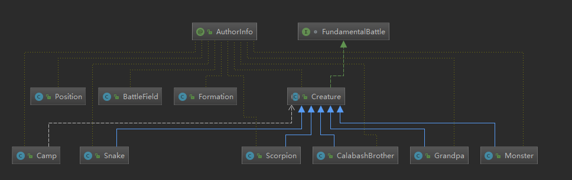

# 葫芦娃大战妖精

## 项目简介
本项目为葫芦娃大战妖精——决一死战，葫芦娃阵营与妖精阵营分居两侧，通过不断移动、攻击，直到完全消灭一方

## 运行说明
1. 可直接双击JavaFinal.jar运行
2. 若使用mvn clean test package命令生成的jar文件，需用压缩包软件打开，在META-INF/MANIFEST.MF文件末尾添加一行
```
Main-Class: njuxwj.sample.Main
```
保存后方可运行此jar包

## 设计思路
### 类简介
<!-- .element width="80%" height="65%" -->
1. BattleField类构建了战场，其成员包含了Position类，即战场上的每个格子，格子记录了在其上的Creature。BattleField类还提供了setCreature方法，可以设置生物在战场上的位置。
2. Creature类为一个**抽象类**，因为它作为基类，而且并不需要实例化。此类包含了生物体所共有的属性和方法，他实现了FundamentalBattle接口，此接口为基础战斗接口，规范了战斗的基本操作，包含移动和攻击两个方法。除此之外，由于每个生物都要实现一个线程，因此Creature类也实现了Runnable接口，实现public void run ()。
```java
interface FundamentalBattle
{
    void moveTo(int x, int y);
    void beAttacked(int dv);
}
```
3. Grandpa、Scorpion、Snake、Monster、CalaBashBrother这五个类继承基类Unit，重写toString方法，以标识各对象的名字。设计继承关系的好处在于不仅能使得对象之间的关系更加清晰，还能为其他类中的方法提供统一的调用参数，避免了相同方法不同参数类型的重载。
4. 由于涉及到阵营，因此创建了Camp类和Formation类，Camp类存储了该阵营的成员（用Unit类型的Arraylist）和（T类型的）leader。Formation类则针对Camp类提供了不同阵型变换的方法。
5. Control类为GUI方面的类，负责用户交互、动画设计以及关联控件方法相关功能。Main类为程序入口。

### 战斗简介
 |生物体|爷爷|葫芦娃|蛇精|蝎子精|小喽啰|
 |:------:|:------:|:------:|:------:|:------:|:------:|
 |死亡率|0.3|0.4|0.4|0.3|0.55|
1. 战斗开始后，所有生物体均能在自己的回合中移动或攻击，移动范围为1格，攻击模式为以自身为中心的3×3网格中选择一位进行单体攻击。两个生物体相遇后，双方均能进行攻击判定，若判定成功，即对对方造成伤害，伤害量为100，若判定失败，则视作对方闪避。不同生物的死亡率不同，攻击的成功率也有所不同。各生物死亡率如上表所示
2. 若生物体被攻击时周围有己方领导者，则本回合获得无敌状态，即使判定成功也不会死亡。在生物体执行完移动或攻击操作后，会sleep 550ms，不仅为了给动画腾出播放时间，也符合客观事实，回合结束后应该休息一段时间。
3. 战斗范围均为近战，生物体移动、被攻击、死亡、闪避、无敌均有相应的平滑流畅的动画展示，使得战斗不会那么突兀，不会产生瞬移或者猝死的现象。
 - 死亡：渐变至透明度为10%，这样可以隐约看到尸体，又不至于阻挡当前战斗场面
 - 被攻击：抖动
 - 闪避：暂时降低透明度至50%，并马上恢复
 - 无敌：盾牌效果
4. 在一场战斗结束后，无需关闭程序，可直接按空格重开一场，也可打开回放。此操作会清空上场战斗的所有记录，如需保存请在重开之前保存回放。
5. 每场战斗结束后，无论胜利或失败均会有相应的结果动画展示
 - 胜利（葫芦娃阵营获胜）
<!-- .element width="80%" height="65%" -->
 - 失败（小喽啰阵营获胜）
<!-- .element width="80%" height="65%" -->

### 关于存档
1. 在存档方面我使用txt格式存储，每个生物行动记录为一行，方便读取。用“M”代表移动，后跟移动到的位置，用“A”代表受到攻击，后跟伤害值，用“D”代表无敌状态下被攻击
2. 如需阅读存档，由于换行符为“\n”，为获得最佳阅读体验，因此**不建议使用windows记事本进行查看**。
3. 由于多线程的异步性，导致播放存档成了一个大坑。其实最初设计的战斗机制比现在更加丰富，老爷爷和蛇精有回血技能，各生物每次攻击会上下浮动，并且攻击力不为100，~~ 毕竟连血条都做好了:sweat::sweat: ~~。然而做好后读档总会发生各种各样的事情，因此只好简化战斗机制。
4. 另外，由于我在存档中使用了中文，编码也成了一个问题，于是我将存档文件同一指定为GBK编码。

## 面向对象思想
 - 封装：此程序封装了多个类，好处在于能隐藏内部实现，提高代码的安全性，也使得代码便于理解
 - 继承：Grandpa、Scorpion、Snake、Monster、CalaBashBrother继承了父类Creature，提高了代码的复用性和可维护性，使类与类之间产生关系，便于理解，也能大大减少代码的冗余程度
 - 多态：Creature的子类重写了父类的方法，在编译器进行动态绑定后，可根据对象类型来调用不同子类的方法，提高可扩充性和可维护性

## 用到的机制
### 多线程
- 每个生物体均实现一个线程，因此Creature类实现了Runnable接口。通过线程池进行管理。当按下空格键时，执行execute方法启动线程
```java
public ExecutorService GoodCampExecutor = Executors.newCachedThreadPool();
public ExecutorService BadCampExecutor = Executors.newCachedThreadPool();
```
```java
private void ExecuteThread()
{
    //执行线程
    for (CalabashBrother cb:gourds) {
        GoodCampExecutor.execute(cb);
    }
    GoodCampExecutor.execute(camp1.getLeader());

    for (Creature temp:camp2.getSoldiers()) {
        BadCampExecutor.execute(temp);
    }
    BadCampExecutor.execute(camp2.getLeader());

    GoodCampExecutor.shutdown();
    BadCampExecutor.shutdown();
}
```
 - 在生物体移动、攻击等使用共享数据的地方等用synchronized关键字加锁，避免发生冲突

### 异常处理
 - 程序多处使用了异常处理机制，以保护代码的执行，同时可以捕获异常，方便定位错误所在地。
```java
try {
    Image image = new Image(s);
    getView().setImage(image);
}catch (Exception e){
    System.out.println(this+"图片未加载成功(单元测试时请无视)");
}

try {
    Thread.sleep(550);
} catch (Exception e) {
    e.printStackTrace();
}
```

### 集合类型
 - 多处使用ArratList、HashpMap等容器以方便编程。
```java
public HashMap<String, ArrayList<String>> history = new HashMap<>();
```
```java
history = new ArrayList<>(controller.history.get(this.toString()));
```


### 泛型
1.在camp类中使用泛型，通过getLeader方法返回的leader对象即为创建时传进的对象，可以使用他自己的方法。
```java
public class Camp<T extends Unit> {
    private ArrayList<Unit>soldiers;
    private T leader;
    ...
    public T getLeader()
    {
        return leader;
    }
}
```
2.在相关方法中的Camp参数中使用类型通配符。
```java
public static void ChangShe(BattleField field,Camp<? extends Unit> camp, int start);
```

### 注解
1. @FXML：用于提示此变量或方法和fxml中的控件相关联
2. @override：用于告知编译器，需要覆写父类的当前方法
3. @Test: 用于告知此方法为单元测试 
4. 自定义注解@AuthorInfo，用于告知类的作者
```java
@Documented
@Inherited
@Retention(RetentionPolicy.RUNTIME)
@Target(ElementType.TYPE)
public @interface AuthorInfo {
    String name();
}
```

### 输入输出
在存档方面使用Java I/O库的整体设计模式——装饰器模式（Decorator），一些流处理器可以对另一些流处理器起到装饰作用，形成新的具有改善了的功能的流处理器
```java
BufferedReader bufferedReader = new BufferedReader(new FileReader(file));
BufferedWriter bufferedWriter = new BufferedWriter(new FileWriter(file,true));
```

## 效果展示
<!-- .element width="80%" height="65%" -->